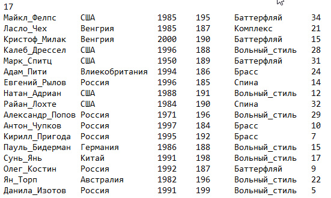
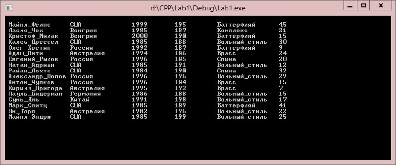
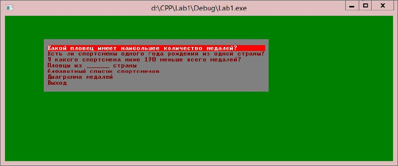
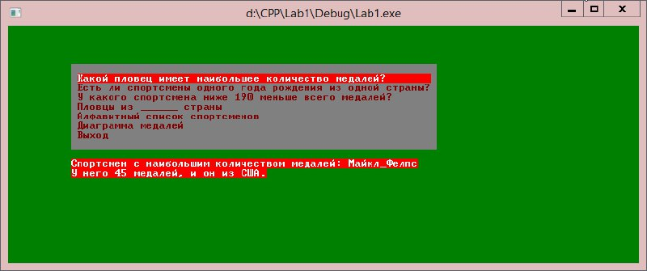
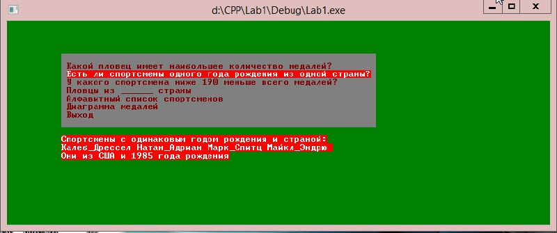
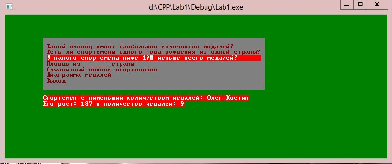
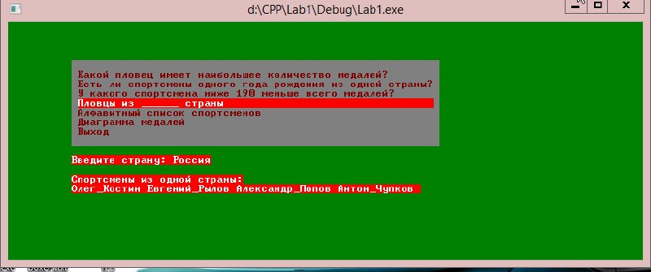
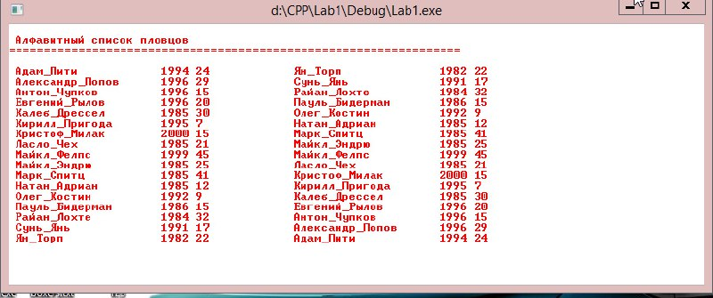
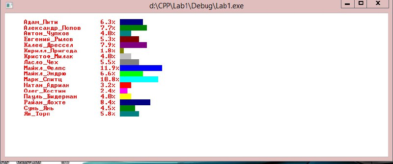

# Данный проект содержит реализацию консольной программы, работающей с текстовыми файлами(базой данных)

### В качестве базы данных был взят текстовый файл с данными о пловцах

## В данном проекте использвались:
  * Функции 
  * Структуры
  * Работа с консолью
  * Форматирование вывода 
  * Работа с файлами

## Реализован следующий функционал:
  * Изначальный вывод всей базы данных при запуске программы

  

  * Меню для работы с базой данных

  

  * Поиск пловца с наибольшим количеством медалей

  

  * Поиск пловцов с одинаковыми параметрами

  
  
  * Параметризированный вывод пловца

  

  * Вывод пловцов из введенной страны

  

  * Вывод обычного и обратного алфавитного списка пловцов

  

  * Вывод диаграммы пловцов по количеству медалей

  

Таким образом, данная программа реализует работу с базой данной, содержащей информацию о пловцах.