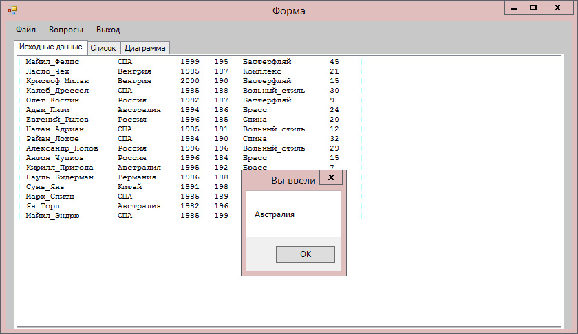

# Данный проект содержит реализацию консольного приложения, работающего с текстовыми файлами(базой данных)

### В качестве базы данных был взят текстовый файл с данными о пловцах

По сути этот проект идентичен проекту Lab1, но здесь реализован интерфейс в виде приложения, что делает программу
более комфортной в использовании.

## В данном проекте использвались:
  * Функции 
  * Структуры
  * Работа с консолью
  * Форматирование вывода 
  * Работа с файлами

## Реализован следующий функционал:
  * Вид приложения после азпуска программы.

  

  * Вывод всей базы данных при открытии файл(Файл -> Открыть -> Выбрать нужный файл(в данном случае swimmers.txt)).

  

  * Меню для работы с базой данных представлено в верхнем меню при нажатии на кнопку "Вопросы".

  * Поиск пловца с наибольшим количеством медалей.

  

  * Поиск пловцов с одинаковыми параметрами.

  
  
  * Параметризированный вывод пловца.

  

  * Вывод пловцов из введенной страны. При нажатии на этот вопрос, у пользователя открывается дополнительное окно,
  в котором он может выбрать предложенную страну из выпадающего списка. После чего ему показывается выбранная страна
  и спортсмены из данной страны.

  
  
  

  * Вывод обычного и обратного алфавитного списка пловцов.

  

  * Вывод диаграммы пловцов по количеству медалей. В варианте приложения выводится круговая диаграмма.

  

Таким образом, данная программа реализует работу с базой данной, содержащей информацию о пловцах, как и Lab1,
но интерфейс представлен в виде приложения, что предоставляет больший комфорт для пользователя.